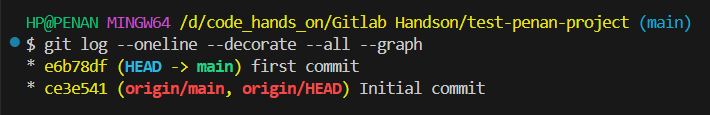
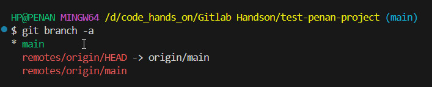

# Git Commands

## 1. Basic Git Commands
### List All Commit and Branches

You can use the following Git command to view all commits along with their branches:

```sh
git log --oneline --decorate --all --graph
```
```sh
Explanation:
--oneline → Displays each commit in a single line for readability.
--decorate → Shows branch names, tags, and HEAD pointers.
--all → Includes commits from all branches.
--graph → Shows a visual representation of branch structures.
```
</img>

### list all branches:

```bash
git branch -a  # Shows local and remote branches
```
</img>


### Go To particular Commit
```bash
git checkout <commit_hash>: Switches to a specific commit.
```

### Create New Branch
```bash
git checkout -b <branch_name>: Creates a new branch and switches to it.
```


### Setting Up Git
```bash
git config --global user.name "Your Name": Set your Git username.

git config --global user.email "your.email@example.com": Set your Git email.
```


### Create a new local repository
```bash
git init: Initializes a new Git repository in the current directory.
```
### Clone an existing repository
```bash
git clone https://github.com/username/repository.git: Clone a repository from GitHub to your local machine.
```
### Check the status of your repository
```bash
git status: Shows the status of files in your working directory (which files are staged, unstaged, or untracked).
```
### Adding files to the staging area
```bash
git add <filename>: Stages a single file for commit.
git add .: Stages all changes (new, modified, and deleted files) in the current directory.
```
### Commit changes
```bash
git commit -m "Your commit message": Commits staged changes with a message.
git commit -a -m "Your commit message": Commits all changes to tracked files (no need to git add first).
```

### View commit history
```bash
git log: Displays the commit history.
git log --oneline: Shows a concise version of the commit history.
git log --graph: Visualizes the commit history as a graph.
```

### Push changes to GitHub
```bash
git push origin main: Pushes your local changes to the remote GitHub repository on the main branch (replace main with your branch name if different).
git push -u origin <branch_name>: Pushes a new branch to GitHub and sets up tracking.
```

### Pull changes from GitHub
```bash
git pull origin main: Fetches and merges changes from the remote repository on the main branch.
```

### Create a new branch
```bash
git branch <branch_name>: Creates a new branch.
git checkout <branch_name>: Switches to the specified branch.
git checkout -b <branch_name>: Creates a new branch and switches to it.
```

### Merge branches
```bash
git merge <branch_name>: Merges the specified branch into your current branch.
```

### Delete a branch
```bash
git branch -d <branch_name>: Deletes a branch (locally).
git push origin --delete <branch_name>: Deletes a branch from GitHub (remotely).
```

### Tagging commits
```bash
git tag <tag_name>: Tags a commit (usually after a release).
git push origin <tag_name>: Pushes a tag to GitHub.
```

### Undo local changes
```bash
git reset --hard HEAD: Resets your working directory and staging area to the last commit.
git checkout -- <file_name>: Discards changes in a file.
```

## 2. GitHub-Specific Commands
```bash
GitHub also offers GitHub CLI (gh) commands for interacting with repositories, issues, pull requests, and more directly from the terminal.
```

### Install GitHub CLI
Installation Guide for different systems. - https://cli.github.com/

### Authenticate with GitHub CLI
```bash
gh auth login: Authenticates with your GitHub account.
```
### Create a new repository
```bash
gh repo create <repo_name>: Creates a new repository on GitHub (can also initialize with --public or --private).

gh repo create --public --source=. --remote=origin: Creates a public repository and pushes the local directory to GitHub.
```
### Clone a GitHub repository
```bash
gh repo clone <username>/<repo_name>: Clones a GitHub repository to your local machine.
```
### List repositories
```bash
gh repo list: Lists repositories of the authenticated user.
```
### Create a pull request
```bash
gh pr create --base <base_branch> --head <head_branch> --title "Title" --body "Description": Creates a pull request from the terminal.

gh pr list: Lists open pull requests.

gh pr merge <pr_number>: Merges a pull request.
```
### View a pull request
```bash
gh pr view <pr_number>: View the details of a pull request.
```
### Assign issues and labels
```bash
gh issue create --title "Issue title" --body "Description": Create a new issue.

gh issue list: List issues in a repository.

gh issue assign <issue_number> --assignee <username>: Assign an issue to a user.

gh issue label <issue_number> --add <label_name>: Add a label to an issue.
```
### Fork a repository
```bash
gh repo fork <repo_name>: Fork a repository on GitHub.
```
### View actions
```bash
gh run list: Lists recent GitHub Actions workflows and runs.
gh run watch <run_id>: Watches the status of a specific workflow run.
```
## 3. GitHub Desktop
```bash
GitHub Desktop is a GUI client for GitHub. While it's not strictly a command, it's a useful tool for interacting with GitHub repositories in a more visual way.
```

## 4. Other Common GitHub Commands
### GitHub Pages (for static websites)
gh pages --deploy: Deploys a site to GitHub Pages.
### GitHub Gists
gh gist create <file> --description "Description": Creates a GitHub Gist from a file.
gh gist list: Lists your gists.

## 5. General GitHub Workflow

### Clone a repository: git clone https://github.com/user/repo.git
### Make changes locally: git add ., git commit -m "message"
### Push changes: git push origin branch-name
### Create and manage branches: git branch, git checkout -b new-branch
### Create and manage pull requests: gh pr create, gh pr merge


## 6. GitHub Actions
GitHub Actions allows you to automate workflows and processes.

### Triggering a workflow
GitHub Actions workflows can be triggered on GitHub through events like push, pull_request, or on a schedule. You set this up in the .github/workflows/ directory in your repository.
### Viewing Workflow Runs
gh run list: Lists recent GitHub Actions runs.
gh run watch <run_id>: Watches the status of a specific workflow run.
